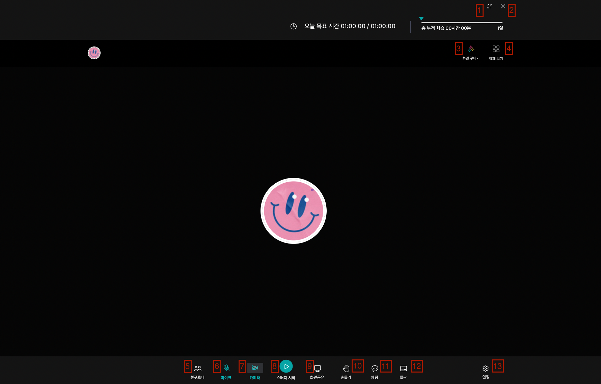
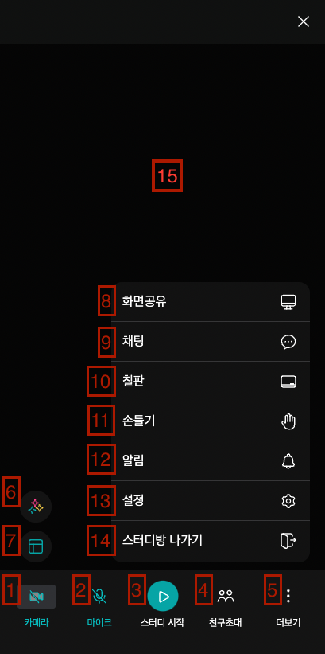
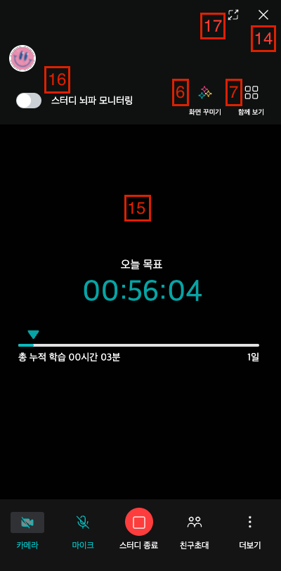
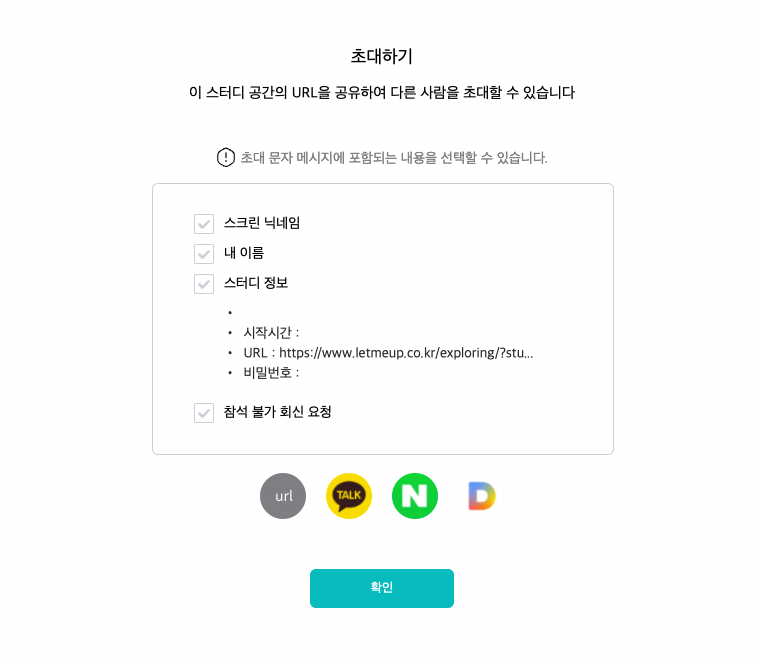

<!-- * 렛미업 JITSI에서 따로 추가하거나 수정한 파일은 모두 ```react/features``` 폴더 안에 있습니다.
* JITSI에서 쓰이는 이미지 & 동영상을 저장해둔 파일은 ```images``` 폴더이고, 앞으로 다른 이미지 혹은 동영상을 추가할 일이 생기신다면, ```images```폴더에 바로 추가해주시면 될 것 같습니다. (```images``` 폴더 안에 종류별로 정리하려고 폴더 여러개 만들어서 빌드하니깐, ```images``` 하위 폴더를 인식을 못하여서 모두 ```images``` 폴더에 직접 넣으시면 될 것 같아요.)
* ```react/features```에 각종 기능 기준으로 폴더들을 나뉘어 보관하고 있는데, 직접적으로 수정한 폴더는 아래와 같습니다.
  * ```react/features/base```
  * ```react/features/chat```
  * ```react/features/conference```
  * ```react/features/filmstrip```
  * ```react/features/notification```
  * ```react/features/large-video```
  * ```react/features/stream-effects```
* 새로 추가한 레이아웃 페이지들은 모두 ```react/features/conference```에 있기 때문에, 대부분의 작업은 이 폴더 안에서 진행하시게 될 것 같습니다.
* ```react/features```에 위치한 폴더에서 직접적으로 쓰이는 파일들은 모두 ```react/features/[file_name]/components/web```에 위치해있습니다. ```native``` 폴더는 안쓰이기 때문에 건들지 않아도 됩니다.

<br />
<br />
<br />
<br />
<br />

--- -->
### 목차
* [실행 방법](#실행-방법)
* [렛미업 통신](#렛미업-통신)
  - [Jitsi에서 Letmeup으로 데이터 전송](#Jitsi에서-Letmeup으로-데이터-전송)
  - [Letmeup에서 Jitsi로 데이터 전송](#Letmeup에서-Jitsi로-데이터-전송)
* [캠스터디 기본 화면](#캠스터디-기본-화면)
* [친구 초대 화면](#친구-초대-화면)
* [설정 화면](#설정-화면)
* [꾸미기 팝업](#꾸미기-팝업)
* [화이트 보드 API](#화이트-보드-API)


<br />
<br />
<br />
<br />
<br />

---

### 실행 방법
* Jitsi 실행
``` zsh
cd jitsi-front/
make              // 빌드할 때
make dev          // 실행
```

* Jitsi 개발서버 올리기
> Jitsi 개발서버 & 실서버 올리는건 미리 세팅 해주셔서 아래 코드 실행하면 자동으로 개발서버 & 실서버에 올라갑니다.
``` zsh
cd jitsi-front
./deploy.sh
```

* Jitsi 실서버 올리기
``` zsh
cd jitsi-front
./prod_deploy.sh
```

자세한건 아래 주소 참고 바랍니다.
> https://jitsi.github.io/handbook/docs/dev-guide/dev-guide-web

<br/>
<br/>
<br/>
<br/>
<br/>

---

### 렛미업 통신
> * JITSI에서 이루어지는 모든 데이터 통신은 LETMEUP 서버를 통하여 이루어집니다.
> * JITSI 페이지가 ```<iframe>```위에서 동작하므로, JITSI에서 통신하려는 페이지와, ```letmeup-front-customer/src/popups/JitsiPopup.jsx``` 이 두 페이지 사이에서 통신하시면 됩니다.

<br />

#### Jitsi에서 Letmeup으로 데이터 전송

* [Conference.js L291 ~ 296](../react/features/conference/components/web/Conference.js)
``` Javascript
askForUpdatedInitialData() {
  window.parent.postMessage({ 
    updateInitialData: true
  }, '*')                                                                   // parent view에 있는 모든 페이지에서 메시지 수신 가능하도록
}
```

* [JitsiPopup.jsx](https://github.com/pineso/letmeup-front-customer/blob/9d2ecf37203b04110a0f6b5e3c6f95c8205e29df/src/popups/JitsiPopup.jsx#L103-L105)
``` Javascript
useEffect(() => {
  window.addEventListener("message", async e => {
    if (e.data.updateInitialData) {
      updateInitialData()
    }
  }
}, [])
```

1. ```Conference.js``` 에서 ```JitsiPopup.jsx``` 로  ```{ updateInitialData: true }``` 전송
2. ```Conference.js``` 에서  ```{ updateInitialData: true }``` 감지
3. ```Conference.js``` 에서 받은 데이터에 대하여 함수 실행

<br />
<br />
<br />
<br />
<br />

#### Letmeup에서 Jitsi로 데이터 전송

* JitsiPopup.jsx
``` Javascript
const JitsiPopup = () => {
  useEffect(() => {
    let iframe = document.getElementById("studyRoom").contentView         // iframe id로 가져오기

    iframe.postMessage({
      dataName: "initialData",
      parentData: {
        initialData: initial_data
      }
    }, "*")                                                               // child view에 있는 모든 페이지에서 메시지 수신 가능하도록
  }, [])

  return (<>
    <iframe id="studyRoom" />
  </>)
}
```

* Conference.js
``` Javascript
async componentDidUpdate(prevProps, prevState) {
  window.addEventListener('message', e => {
    if (e.data.dataName === "initialData") {
      this.updateSetting()
    }
  })
}
```

1. ```JitsiPopup```에서 ```Conference.js```로 데이터 ```{ dataName: "initialData", parentData: { initialData: initial_data } }``` 전송
2. ```Conference.js``` 에서 메시지 수신
3. ```Conference.js``` 에서 수신한 메시지 내용 중 ```dataName```을 기준으로 무슨 내용인지 판단 및 수신한 데이터 저장
4. ```Conference.js``` 에서 수신한 데이터에 대하여 함수 실행

<br />

> 설명이 부족하시면 _[여기](https://velog.io/@hn04147/iframe-%EC%97%90%EC%84%9C-%EB%8F%84%EB%A9%94%EC%9D%B8%EC%9D%B4-%EB%8B%A4%EB%A5%B8-%EA%B2%BD%EC%9A%B0-%EB%B6%80%EB%AA%A8-%EC%9E%90%EC%8B%9D%EC%B0%BD-%EC%A0%9C%EC%96%B4)_ 서 더 확인하시면 될 것 같습니다.


<br />
<br />
<br />
<br />
<br />

---

### 캠스터디 기본 화면

[Conference.js 바로가기](../react/features/conference/components/web/Conference.js)

캠스터디에 진입하였을 때 처음으로 보이는 화면의 UI들은 기본적으로 모두 ```Conference.js```안에 있는 ```render()```에 작성되어 있습니다.
데스크탑과 모바일 두 화면 모두 ```Conference.js``` 안에 ```<Desktop>, <Mobile>``` 태그를 통하여 정의되어 있습니다.

[```Conference.js```](../react/features/conference/components/web/Conference.js)에서 쓰이는 기능들과 다이렉트되는 페이지들은 아래와 같습니다.



##### Desktop
* 윗쪽 기능 버튼
  * 1. 캠스터디 전체 화면 변경 
    * ```<DesktopScaleButton> Line 829```
    * 데스크탑 화면에서 화면 크기를 바꿔주는 버튼입니다. 누르면 큰 화면, 작은 화면 전환되며, ```this.state.isBigScreen```으로 현재 큰 화면인지 작은 화면인지 판별합니다.
    <br />

  * 2. 캠스터디 종료 
    * ```<DesktopExitButton> Line 839```
    * 캠스터디를 종료할 때 쓰이는 버튼입니다. ```onClick```시 ```this.state.closeIframe: true```가 되며, ```studySeq, studyTime```을 LETMEUP으로 전송하여 스터디 종료 API를 실행하게 됩니다.
    <br />
    
  * 3. 필터 & 스티커 팝업 열기
    * ```<DesktopFilterButton> Line 882```
    * 필터, 스티커를 쓸 수 있는 꾸미기 팝업을 띄울 때 쓰이는 버튼입니다. ```this.props.dispatch(setFilterPopup(true))```가 실행되며, ```this.props._filterPopup```을 기준으로 ```<FilterPopup>```을 화면에 띄웁니다.
    <br />
    
  * 4. 화면 레이아웃 변경 
    * ```<DesktopLayoutButton> Line 894```
    * 데스크탑 캠스터디 화면 레이아웃 변경할 때 쓰이는 버튼입니다. ```this.state.isTileView: !this.state.isTileView```가 되며, ```this._doSetTileView()```를 실행합니다.
<br />

* 아랫쪽 기능 버튼 (```<DesktopFotterButtonsArea>``` 에 있는 것들)
  * 5. 친구 초대 팝업
    * ```<DesktopSideButton className="desktop-invite-friend-button"> Line 922```
    * 친구 초대 팝업을 띄우는 버튼입니다. ```this.state.inviteFriendPopup: true```가 되며, ```<InviteFriendPopup>```을 화면에 띄웁니다.
    <br />
    
  * 6. 마이크 토글 버튼
    * ```<DesktopSideButton className="desktop-microphone-button"> Line 935```
    * 마이크 음소거 및 음소거 해제를 담당하는 버튼입니다. 마이크 토글 버튼은 순정 JITSI에 있었던 마이크 토글 버튼을 그대로 가져와 UI만 바뀐 형태로 쓰여지고 있습니다.
    * ```<AudioSettingsButton />```이 원래 Jitsi에 있던 마이크 토글 버튼입니다.
    <br />
    
  * 7. 카메라 토글 버튼
    * ```<DesktopSideButton className="desktop-camera-button"> Line 950```
    * 카메라 On/Off 버튼입니다. 마이크 토글 버튼처럼 원래 JITSI에서 쓰이던 카메라 버튼을 그대로 가져와 UI만 바꾸어 쓰이고 있습니다.
    * ```<VideoSettingsButton />```이 원래 Jitsi에 있던 카메라 토글 버튼입니다.
    <br />
    
  * 8. 스터디 시작/종료 버튼
    * ```<DesktopCenterButton className="desktop-study-start-button"> Line 962```
    * 스터디 시작 및 종료할 때 누르는 버튼입니다. 클릭시 ```this.study_start_button_clicked()```가 실행되며, UI도 마찬가지로 시작 -> 종료 / 종료 -> 시작 으로 바뀌게 됩니다.
    <br />
    
  * 9. 화면 공유 버튼
    * ```<DesktopSideButton className="desktop-screen-share-button"> Line 972```
    * 화면 공유 팝업을 띄우는 버튼입니다. 클릭시 ```this._doToggleScreenshare()```가 실행되며, 브라우저 위에 화면 공유 허용 팝업과 화면 공유 팝업이 뜨게 됩니다.
    <br />
    
  * 10. 손들기 버튼
    * ```<DesktopSideButton className="desktop-raise-hand-button"> Line 986```
    * 손 들기 & 손 내리기를 할 수 있는 버튼입니다. ```this._doToggleRaiseHand()```가 실행되며, ```this.props._localParticipant.raiseHand```를 통하여 현재 사용자가 손을 들고 있는지, 내리고 있는지 판단합니다.
    <br />
    
  * 11. 채팅 버튼
    * ```<DesktopSideButton className="desktop-chat-button"> Line 999```
    * 채팅창을 켜고 닫을 수 있는 버튼입니다. ```this._doToggleChat()```을 실행하며, 방해 금지 모드가 아닐때 채팅이 오면 자동으로 채팅창이 열립니다.
    * ```this.props._isChatOpen```를 통하여 현재 채팅창이 열려있는지 닫혀있는지 상태를 알 수 있습니다.
    * ```this.props._chatCount```를 통하여 방해 금지 모드일 때 수신된 메시지 개수를 알 수 있습니다. 또한, 방해 금지 모드가 아닐 때, ```this.props._chatCount```를 통하여 메시지 수신 여부를 판단하고, 채팅창이 열립니다.
    <br />
    
  * 12. 화이트보드 버튼
    * ```<DesktopSideButton className="desktop-whiteboard-button"> Line 1027```
    * 화이트보드 팝업을 띄우는 버튼입니다. ```this.state.confirmWhiteboardPopup: true```가 되며, ```<ConfirmWhiteboardPopup>```을 띄웁니다.
    <br />
    
  * 13. 설정 버튼
    * ```<DesktopSettingButton className="desktop-setting-button"> Line 1044```
    * 설정 팝업을 띄우는 버튼입니다. ```this.state.settingPopup: true```가 되며, ```<SettingPopup />```을 띄웁니다.
    <br />
    

##### Mobile

 

모바일에서 쓰이는 버튼들의 기능은 데스크탑과 동일하다.

모바일에서 (5) 더보기 버튼을 누르면 ```this.state.morePopup: true```가 되면서 좌측처럼 더보기 메뉴가 활성화된다. 이 때, 다른 버튼을 누르게되면, 더보기 메뉴를 닫아야되므로, 다른 버튼을 누를 시, ```this.state.morePopup: false```를 같이 실행하여 더보기 메뉴를 닫아준다.

(8) ~ (14)에 해당되는 버튼은 더보기 버튼(5)을 눌러 더보기 메뉴가 활성화 되었을 시 나오는 메뉴로, [```MoreBtnModal.js```](../react/features/conference/components/web/MoreBtnModal.js)에 정의되어있다.

1. 카메라 토글 버튼
1. 마이크 토글 버튼
1. 스터디 시작/종료 버튼
1. 친구 초대 버튼
1. 더보기 버튼
1. 꾸미기 버튼
1. 레이아웃 변경 버튼
1. 화면 공유 버튼
1. 채팅 버튼
1.  화이트보드 버튼
1.  손들기 버튼
1.  알림 버튼
1.  설정 버튼
1.  스터디 나가기 버튼
1.  메인 화면
1.  스터디 뇌파 모니터링 토글 버튼
1.  전체화면 버튼

<br />

#### 함수들
* ```async componentDidUpdate(prevProps, prevState) Line 325```
  * 캠스터디에 들어오자 마자 실행되는 함수이며, ```useEffect(() => {}, [])``` 같은 친구이다. 
  * 캠스터디에 들어오자 마자 :
    * 현재 유저가 이미 방에 들어와있는 유저인지 확인한다. 만약 이미 들어와있는 유저일 경우, ```this.state.checkAlreadyExistUser: true```로 바꾸고, 스터디에서 나가도록 한다.
    * 전에 참가했던 캠스터디에서 사용했던 필터의 정보가 JITSI 특성상 남아있으므로, 카메라 필터를 초기화 시켜준다.
  * LETMEUP과의 메시지 송수신은 모두 여기서 이루어진다.
  <br />

* ```_doToggleChat() Line 500```
  * 채팅창을 열거나 닫는다.
  <br />

* ```_doToggleScreenshare() Line 510```
  * 화면 공유 팝업을 띄운다.
  <br />

* ```_doSetTileView() Line 520```
  * 캠스터디 레이아웃을 변경한다.
  * 타일뷰 -> 혼자 화면 / 혼자 화면 -> 타일뷰
  <br />

* ```_doToggleRaiseHand()```
  * 손들기, 손내리기 기능 버튼.
  <br />

* ```to_time(time) Line 541```
  * 시간(초)를 입력받으면 'HH:MM:SS' 형식으로 배열에 담아서 return하는 함수
  * Input: ```5000``` 
  * Output: ```[01, 23, 20]```
  <br />

* ```time_to_second(time) Line 552```
  * 시간(HH:MM:SS)를 입력받으면 총 몇초인지 반환받음
  * Input: ```"01:23:30"```
  * Output: ```5000```
  <br />

* ```plus_time() Line 556```
  * ```this.state.todaysLearningTime``` 과 ```this.state.totalLearningTime```을 1씩 올려줌
  * 스터디 시작 버튼을 눌렀을 때 실행되는 ```study_start_button_clicked() -> this.state.intervalId -> setInterval()```에서 실행된다.
  <br />

* ```renderGoalTime(type) Line 564```
  * 입력받는 type에 따라 데스크탑 혹은 모바일에서의 목표 시간을 반환해준다.
  <br />

* ```study_start_button_clicked() Line 575```
  * 스터디 시작/종료 버튼을 클릭하였을 때 실행되는 함수이다.
  * 스터디 시작시 (```this.props._studyStart === false```) :
    * ```this.state.intervalId```에 ```setInterval((), 1000)```하여, 1초마다 ```this.plus_time()```이 실행되도록 한다.
    * ```setStudyStart(true)```를 ```dispatch```한다.
  * 스터디 종료시 (```this.props._studyStart === true```) :
    * 스터디가 종료되었다고 LETMEUP에 통신 및 데이터 전송을 하여 스터디 종료 API를 실행할 수 있도록 한다.
    * ```this.props.dispatch(setUpdateInitialData(true))```하여 스터디 종료로 인하여 업데이트된 데이터를 다시 받아올 수 있도록 한다.
    * 스터디 시작시 ```dispatch```한 ```setStudyStart(true)```를 다시 ```false```로 ```dispatch```한다.
    * 공부시간을 업데이트해주고, 스터디 시작 후 공부한 시간(```todaysLearningTime```)을 ```0```으로 초기화한다.
    * 더이상 1초마다 ```this.plus_time()```이 실행되지 않도록 ```clearInterval(this.state.intervalId)```를 해준다.
  <br />

* ```handleMobileProgressbarAreaClick() Line 617```
  * 모바일 화면에서 스터디 시작 후 빈 화면을 클릭했을 때 Progress Bar 화면이 3초동안 보였다가 없어지도록 하는 함수
  * ```this.state.mobileProgressbarInterval: setInterval(() => {}, 3000)```로 설정하여 3초동안 Progress Bar 화면이 보이도록 한다.
  <br />

* ```handleMobileProgressbarClearInterval() Line 633```
  * ```handleMobileProgressbarAreaClick()```에서 설정한 ```this.state.mobileProgressbarInterval```을 초기화 시켜주는 함수
  <br />

* ```handleMorePopupClicked() Line 641```
  * 모바일 화면에서 더보기 버튼를 클릭했을 때, 더보기 메뉴가 띄워지도록 하는 함수
  * 더보기 메뉴가 띄워질 때, ```this.state.mobileProgressbarInterval```도 초기화 시켜준다.
  <br />

* ```getSecondsFromStudyStart() Line 651```
  * 스터디 개설 시간으로 부터 현재까지의 초를 계산하는 함수이다.
  * 만약 스터디가 무료 스터디일 경우, 개설 시간으로 부터 1시간이 넘어가면 유저를 강제 퇴장 처리 한다.
  <br />

* ```renderUserIcons() Line 663```
  * 좌상단에 유저 아이콘을 렌더링하는 함수이다.
  * 본 유저(나)를 제외한 다른 사람의 아이콘을 렌더링한다.
  <br />

* ```updateDeviceInitialSetting(camera, microphone, speaker) Line 683```
  * 카메라, 마이크, 스피커 초기 상태를 받아 ```this.state```에 업데이트 시켜준다.
  <br />

* ```updateStudyRoomPasswordSetting(password) Line 698```
  * 비밀번호를 받아 ```this.state```에 업데이트 시켜준다.


<br />
<br />
<br />
<br />
<br />

---

### 친구 초대 화면

[InviteFriendPopup.js 바로가기](../react/features/conference/components/web/InviteFriendPopup.js)


```Confrence.js```에서 ```<InviteFriendPopup />```을 실행하면 나오는 친구 초대 팝업창입니다.



상위 폴더에서 ```props```로 ```onClose, roomName, nickname, usingPassword, studySeq, isFree, dateStart, userSeq```를 받습니다.
각 ```props```의 의미는 다음과 같습니다.
* ```onClose``` : 팝업창 닫을 때 호출하는 함수
* ```roomName``` : 스터디방 이름
* ```nickname``` : 스크린 닉네임
* ```usingPassword``` : 비밀번호 사용 여부. 비밀번호를 사용한다면 비밀번호가 들어있고, 사용하지 않으면 빈 값으로 넘겨준다.
* ```studySeq``` : 스터디 Sequence Number
* ```isFree``` : 스터디가 무료인지 유료인지 판단하는 변수
* ```dateStart``` : 스터디 시작 시간
* ```userSeq``` : 해당 유저 Sequence Number
<br />

##### 함수들
* ```copyToClipboard() Line 12```
  * URL 아이콘을 눌렀을 때 해당 스터디로 연결되는 초대 URL을 복사하는 함수입니다.
  <br />

* ```GetStartTime(dateStart, isFree) Line 25```
  * 해당 스터디가 무료/유료인지 토대로 스터디 시작 시간을 계산하는 함수입니다.
  <br />

* ```PrintMiddleBox() Line 41```
  * 데스크탑 화면에서 중앙 회색 박스안에 있는 요소를 렌더링하는 함수입니다.
  <br />

* ```PrintShareIcons() Line 84```
  * 공유 버튼 4가지를 렌더링하는 함수입니다.
  <br />


<br />
<br />
<br />
<br />
<br />

---

### 설정 화면

[SettingPopup.js 바로가기](../react/features/conference/components/web/SettingPopup.js)

상위 폴더에서 ```props```로 ```onClose, initialData, updateDeviceInitialSetting, updateStudyRoomPasswordSetting, tabs, dispatch, askForUpdatedInitialData```를 받으며 각 ```props```의 의미는 다음과 같습니다.
* ```onClose``` : 팝업창 닫을 때 호출하는 함수
* ```initialData``` : 스터디 초기 정보
* ```updateDeviceInitialSetting``` : 설정 팝업에서 초기 장치 설정을 바꾸고 저장할 때 호출하는 함수
* ```updateStudyRoomPasswordSetting``` : 설정 팝업에서 비밀번호 설정을 바꾸고 저장할 때 호출하는 함수
* ```tabs``` : 설정 디바이스들의 정보가 들어있는 객체
* ```dispatch``` : 그냥 ```props```로 받아왔어요
* ```askForUpdatedInitialData``` : 업데이트된 초기 정보를 불러오는 함수

설정 팝업에 총 4가지 메뉴 ```장치, 비밀번호, 스터디 정보, 참여자```가 있습니다.
스터디 개설자는 모든 메뉴에 접근 가능하며 수정 가능하나, 스터디 개설자가 아닌 유저들은 장치 메뉴에 있는 드롭다운 메뉴만 사용 가능합니다.

```currentMenu```를 통하여 현재 위치한 메뉴를 알 수 있습니다.

<br />

##### 함수들
* ```useEffect(() => {}, []) Line 61```
  * 업데이트된 초기 정보를 불러온다.
  * 현재 설정된 디바이스 정보를 불러온다.
  * 참여자 수에 따른 체크박스를 만든다.
  <br />

* ```onSave() Line 97```
  * 초기 장치 설정, 비밀번호 설정을 저장할 때 실행하는 함수이다.
  * 방장만 실행할 수 있다.
  * 초기 장치 설정과 비밀번호 설정을 ```postMessage```를 통하여 LETMEUP에 데이터 전송 후 초기 장치 설정, 비밀번호 설정 API를 실행한다.
  <br />

* ```SaveDeviceSelection() Line 145```
  * VideoInputDevice, AudioInputDevice, AudioOutputDevice를 설정한다.
  <br />

* ```RenderUsers(i, idx) Line 159```
  * 참여자 메뉴에서 참여자 정보를 렌더링하는 함수.
  <br />

* ```printMobileStudyPeriod(schedules, isLoop) Line 210```
  * 모바일 화면에서의 스터디 정보 메뉴에서 스터디 기간을 렌더링한다.
  <br />

* ```printStudyPeriod(schedules) Line 230```
  * 데스크탑 화면에서의 스터디 정보 메뉴에서 스터디 기간을 렌더링한다.
  <br />

* ```onClickCheckAll() Line 247```
  * 참여자 정보 메뉴에서 사용자 체크박스 모두 체크하는 함수.
  <br />

* ```onClickBlock() Line 257```
  * 참여자 정보 메뉴에서 선택된 참여자를 차단하는 함수.
  * ```userSeqs```와 차단 여부 ```isBlock: 'Y'```을 LETMEUP으로 전달하여 차단 API를 실행한다.
  <br />

* ```onClickUnblock() Line 277```
  * 참여자 정보 메뉴에서 선택된 참여자 차단을 푸는 함수.
  * ```userSeqs```와 차단 여부 ```isBlock: 'N'```을 LETMUEP으로 전달하여 차단 푸는 API를 실행한다.
  <br />


##### 캘린더 팝업

스터디 정보 메뉴에서 ```캘린더로 보기```를 클릭하면 ```<Schedules />```가 실행되어 캘린더 팝업창이 띄워진다.
```props```로 초기 데이터 ```initialData?.studySettingData?.calendar```를 준다.
```initialdata?.studySettingData?.calendar```은 24 x 7의 2차원 배열이다.

<br />
<br />
<br />
<br />
<br />

---


### 꾸미기 팝업

<br />
<br />
<br />
<br />
<br />

---

### 화이트 보드 API

```Conference.js```에서 ```<ConfirmWhiteboardPopup />```를 실행하여 '예'를 클릭하면, ```<WhiteboardPopup />```이 실행된다.